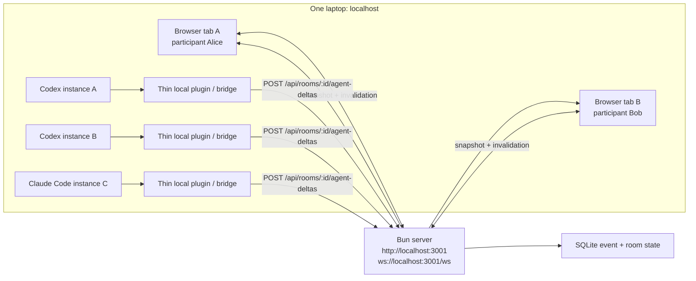

# Realtime Alignment Workspace POC

This folder contains a self-contained implementation of the docs-only plan in [`docs/realtime-alignment-workspace-poc-plan.md`](../docs/realtime-alignment-workspace-poc-plan.md).

It ships a vertical slice with:

- Bun HTTP + WebSocket server
- React + Vite client
- SQLite persistence
- realtime room timeline and alignment board
- private pending deltas plus promotion into shared reasoning
- ADR drafting with section claims, review markers, and approval gates
- plan generation with workstream owner acceptance
- human-triggered handoff package export

## Run it

From the repo root:

```bash
cd georg
just install
just dev
```

Open `http://localhost:5173`.

The Vite client runs on port `5173`. The Bun server runs on port `3001` by default and honors `PORT` if you need a different local port. The SQLite database is created at `georg/db/workspace.sqlite`.

## Useful commands

```bash
cd georg
just check
just build
just start
```

`just start` serves the built frontend from Bun after `just build`.

## OpenAI requirement

The product path for this POC is OpenAI Responses only. Set an API key before running the end-to-end room flow:

```bash
cd georg
export OPENAI_API_KEY=your_key_here
just dev
```

If you only need a local smoke test without a provider, set `ALLOW_LOCAL_HEURISTIC_FALLBACK=1` explicitly. That fallback exists only for local development verification and is not the intended product path.

## Pre-commit

This folder includes a scoped pre-commit config based on the reference setup, but limited to `georg/` files.

Install and run it from the repo root:

```bash
just -f georg/justfile precommit-install
just -f georg/justfile precommit-run
```

The hooks cover:

- Prettier formatting
- ESLint autofix
- TypeScript typecheck
- merge-conflict marker detection
- max-lines guard

## Notes

- The room is snapshot-driven on the client: writes go through HTTP, and the UI refetches on WebSocket invalidation.
- Section claims auto-release after 60 seconds of inactivity on the server.
- Handoff packages are generated explicitly by a human after ADR and plan approval.

## Multi-Agent Local Connectivity

This slice already supports the core multi-participant pattern on one laptop: many humans can join one room, each human can submit private agent deltas, and the shared UI stays in sync through `/ws` invalidation fanout.

What is implemented today:

- the shared web client subscribes to `ws://localhost:3001/ws?roomId=...&participantId=...`
- private agent suggestions are submitted over HTTP to `POST /api/rooms/:roomId/agent-deltas`
- only the owning human can promote or discard those deltas
- promotion moves the delta into shared reasoning; pending deltas stay private to the owner and orchestrator path

What is not implemented yet:

- a dedicated Codex or Claude Code plugin project in this repo
- a separate agent-only WebSocket protocol for pushing typed deltas directly from a plugin runtime

The intended shape is still straightforward: each Codex or Claude Code instance runs locally, keeps its full repo/session context private, and forwards only distilled deltas to the Bun server.



### Plugin shape

A Codex plugin for this slice can stay very small:

1. Read local Codex context on the developer machine.
2. Let the human choose a concise delta worth sharing.
3. Submit that delta to the room as a pending private suggestion.
4. Let the human promote it from the right rail in the web UI, or call the promote endpoint explicitly.

Minimal payload shape for a plugin bridge:

```json
{
  "actorId": "participant_id_for_this_human",
  "sourceAgent": "codex-plugin",
  "text": "We should reuse the existing Bun realtime server instead of adding a second queue.",
  "type": "agent_insight"
}
```

### Local laptop test

The easiest local test does not require a real plugin yet. Run the server and simulate multiple Codex or Claude Code clients with separate terminals plus `curl`.

1. Start the app:

```bash
cd /Users/geoheil/development/jubust/codex-hackathon-26-vienna/georg
export OPENAI_API_KEY=your_key_here
just dev
```

2. Open the UI in one or two browser tabs:

- [http://localhost:5173](http://localhost:5173)
- create a room, or note the `roomId` of an existing room

3. Create two participants if you want to simulate two separate Codex or Claude Code sessions:

```bash
curl -s -X POST http://localhost:3001/api/rooms/$ROOM_ID/join \
  -H 'content-type: application/json' \
  -d '{"displayName":"Alice","role":"decision_owner"}'

curl -s -X POST http://localhost:3001/api/rooms/$ROOM_ID/join \
  -H 'content-type: application/json' \
  -d '{"displayName":"Bob","role":"contributor"}'
```

Store the returned participant ids as `ALICE_ID` and `BOB_ID`.

4. From one terminal, simulate a Codex plugin for Alice:

```bash
curl -s -X POST http://localhost:3001/api/rooms/$ROOM_ID/agent-deltas \
  -H 'content-type: application/json' \
  -d "{
    \"actorId\":\"$ALICE_ID\",
    \"sourceAgent\":\"codex-plugin\",
    \"text\":\"Use the existing Bun server and keep private deltas pending until a human promotes them.\",
    \"type\":\"agent_insight\"
  }"
```

5. From another terminal, simulate a second Codex or Claude Code session for Bob:

```bash
curl -s -X POST http://localhost:3001/api/rooms/$ROOM_ID/agent-deltas \
  -H 'content-type: application/json' \
  -d "{
    \"actorId\":\"$BOB_ID\",
    \"sourceAgent\":\"claude-code-bridge\",
    \"text\":\"Bob sees a risk: drafting should stay blocked while unresolved differences remain.\",
    \"type\":\"agent_insight\"
  }"
```

6. In each browser session, confirm the behavior:

- Alice sees only Alice's pending delta in Alice's perspective pane
- Bob sees only Bob's pending delta in Bob's perspective pane
- neither pending delta appears in the shared room timeline yet

7. Promote one delta from the UI, or call the endpoint directly:

```bash
curl -s -X POST http://localhost:3001/api/rooms/$ROOM_ID/agent-deltas/$DELTA_ID/promote \
  -H 'content-type: application/json' \
  -d "{\"actorId\":\"$ALICE_ID\"}"
```

8. Confirm the promoted delta now affects shared state:

- the shared room invalidates over `/ws`
- the promoted insight can appear in alignment state and later orchestrator synthesis
- the non-promoted delta remains private

### If you build the real plugin later

The thinnest practical local plugin is just:

- an editor/CLI-side command that asks "submit current insight to room?"
- a room selector storing `roomId` and `participantId`
- one HTTP call to `POST /api/rooms/:roomId/agent-deltas`
- optional polling or `/ws` subscription so the plugin can show "pending", "promoted", or "discarded"

That same bridge shape works for multiple local Codex instances, Claude Code sessions, or other developer-side agent clients, as long as each one submits deltas under the correct human participant id.
