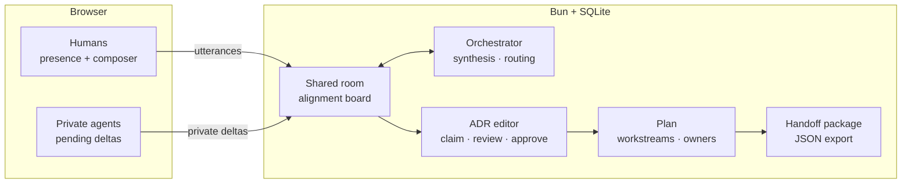

  
  POC · vertical slice

# Realtime Alignment Workspace

Agreement before generation.

  Codex Hackathon · Vienna · 2026

  Press <kbd>→</kbd> to start · <kbd>o</kbd> for overview · <kbd>d</kbd> for dark mode

---
layout: center
class: text-center
---

# Every AI coding tool skips the hardest part.

<h1 class="mt-10" style="font-size: 6rem; color: var(--ra-accent); font-style: italic;">Agreement.</h1>

---

# The pain we kept hitting

<v-clicks>

- **Four engineers** on one decision
- **Three LLMs** running in parallel
- **Zero shared context** across any of it
- Everyone ships different code
- Nobody trusts any of it

</v-clicks>

**What happens today**

1. Slack thread drifts
2. Agents generate in isolation
3. Code review becomes re-litigation
4. Nobody remembers *why* the choice was made
5. The ADR, if one exists, is stale by Monday

---

# Our thesis

<v-clicks depth="2">

- **Shared room** — humans + agents see the same synthesized state
- **Private work** — agents drop deltas only you see, then you promote
- **Orchestrator** — synthesizes, nudges, routes insights
- **Gates, not drift** — ADR approved → plan generated → handoff shipped
- **Evidence, not vibes** — every node traces back to an event in the log

</v-clicks>

  Agreement before generation.

---
layout: two-cols-header
---

# The three primitives

::left::

### Shared room

The alignment board with eight color-coded columns: 
*goal · constraint · option · tradeoff · risk · open · agreement · blocker*

Every utterance is classified into a node with confidence and an event trail.

::right::

### Private work

Your codex plugin drops deltas visible only to you and the orchestrator.

**Promote** to share, **discard** when it misses. No leakage.

### Orchestrator

Synthesizes recent events, suggests the next move, and routes private nudges to the participant who needs them.

---
layout: center
---

# Short video demo

<video
  src="/hackathon-video.mp4"
  controls
  autoplay
  loop
  muted
  playsinline
  class="w-full rounded-xl shadow-2xl"
  style="max-height: 62vh; border: 1px solid var(--ra-line);"
/>

  44 seconds · a room converges on an ADR, generates a plan, ships a handoff

<!--
If the video is missing, run from georg/: `just demo` (renders with Remotion, copies into slides/public, then starts the deck).
-->

---

# Live demo — the path we'll walk

<v-clicks>

1. Open <kbd>http://localhost:5173</kbd>
2. **Create a room** with a bounded decision
3. Post two utterances → watch the alignment board populate
4. Submit a **private delta** → **promote** it
5. **Claim** an ADR section → **Regenerate** → **Review** → **Approve**
6. **Generate plan** → **Accept owner** → **Approve plan**
7. **Generate handoff** → download the JSON package

</v-clicks>

**What to look for**

- The pulsing accent dot = live orchestrator
- Presence pills with initials = who's here
- Readiness chips flipping green = gates closing
- Quorum pips next to *Approve* = N of M owners
- The **Next move** hint = what to do right now

**Failure demo**

Switch mode to *draft_adr* with an unresolved blocker — the system refuses until you resolve, dissent, or mark it non-blocking.

---

# Architecture

  
Bun + WebSockets · sub-second presence

  
SQLite · append-only event log

  
OpenAI Responses · swappable provider

  
React 19 · Vite · Slidev · Remotion

---

# Why this wins

<v-clicks>

- **Trust** — nothing is generated until humans agree
- **Speed** — quorum and readiness are *visual* · no meetings to re-check status
- **No drift** — orchestrator re-anchors to the ADR every synthesis
- **Realtime** — Bun + WebSockets · changes reach every participant in < 1s
- **Portable output** — the handoff package is a single JSON envelope downstream tools can replay
- **Agent-ready** — a bridge plugin lets Codex, Claude, or any local agent submit deltas

</v-clicks>

---

# What we cut (and why)

### Out of scope for the slice

- CRDT co-editing
- Voice / video
- Autonomous agent decisions
- Multi-workspace management UI
- Streaming synthesis (SSE)

### Why

Every item we cut was something the **alignment primitive** doesn't need to prove.

The slice has to show that *agreement before generation* survives contact with real humans and real LLMs. Everything else is an extension.

---

# What's next

<v-clicks>

- **Streaming orchestrator** via server-sent events — synthesis appears token-by-token
- **Multi-room workspaces** with cross-room evidence graphs
- **First-class agent bridges** — Codex, Claude Code, Cursor
- **Guardrail enforcement** at approval time (policy-as-code)
- **Time-travel** — replay a decision by scrubbing the event log
- **Exports** — Linear, Jira, GitHub issues from workstreams

</v-clicks>

---
layout: center
class: text-center
---

  
  thanks

# Realtime Alignment Workspace

Agreement before generation.

  Q &amp; A · <kbd>esc</kbd> to exit · <kbd>p</kbd> for presenter mode

